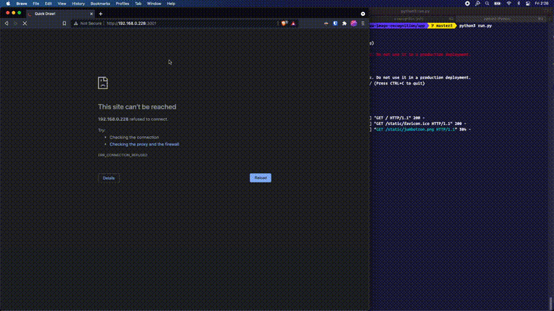

# Captcha Creation
A CAPTCHA is an automated test that humans (even those of low intelligence) can pass easily, while AI or Machines (even if they are advanced), will fail.

## Goals
Your goal is to design a new CAPTCHA (Completely Automated Turing Test to tell Computers and Humans Apart).  We want you to design a new CAPTCHA. You will be judged on the following criteria:

1.  How good is it, in practice, as a CAPTCHA? Can we think of an easy way to build a bot that passes it? Will every human pass it? *(40 Points)*
    

2.  How user friendly is the CAPTCHA? Humans, unlike machines, have short attention spans, so labelling a hundred different picture might be, in theory, a good CAPTCHA, but humans won’t sit through that! *(20 points)*
    
  
3. How creative is it? There are many standard CAPTCHA mechanics, can you either:
	 a.) Combine them in a unique and fun way? b.) Create a brand new method? *(25 points)*
    

4.  How applicable is it to different situations? AI is beginning to invade many different areas of life. Traditionally CAPTCHAs are used on websites, but would your CAPTCHA be able to be used in different circumstance. For example, to tell the difference between a lifelike robot and a real person in a real-life setting? How about over the phone? Argue why your CAPTCHA is the CAPTCHA of the future. *(15 points)*


-----


# Google QuickDraw as Captcha
Makes use of quick-draw-image-recognition to implement a basic captcha login authentication. You can learn more about quick-draw-image-recognition [here](https://github.com/Lexie88rus/quick-draw-image-recognition/blob/master/Quick%20Draw%20Report.pdf).


### Setup Instructions
To run the web application follow steps:
1. Download or clone the repository.
2. From root folder run command to build the model:
```
$ pip install
$ python build_model.py
```
3. Navigate to `app` folder:
```
$ cd ../app
```
4. Run app:
```
$ python run.py
```
5. Open http://0.0.0.0:3001/ in browser.


